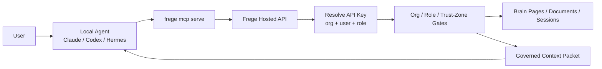
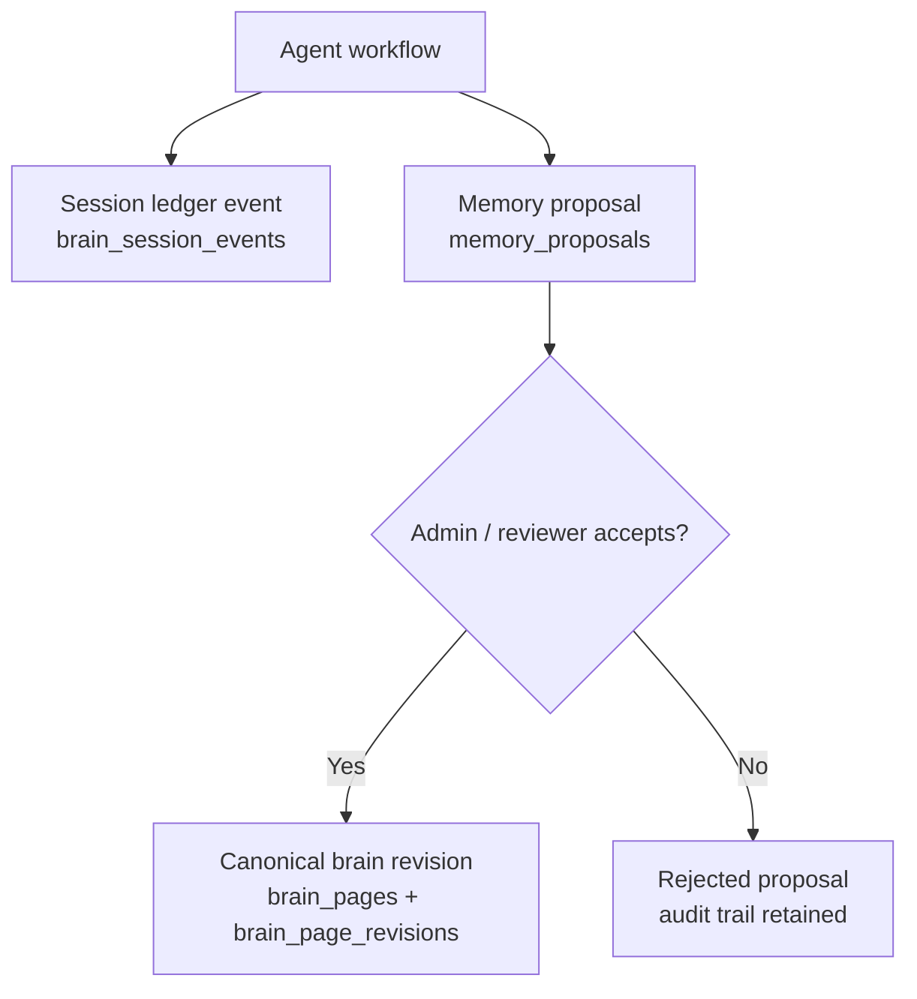
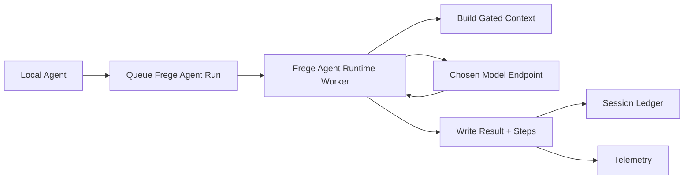

# Frege Hosted Brain Architecture

Last updated: 2026-06-19

This is the current backend plan and implementation summary for the Frege prototype. It reflects the decision to make Frege a hosted SaaS control plane and brain database, with local development and a thin local MCP/CLI client.

## Current Status

- Local app: `http://localhost:3000`
- Admin console: `http://localhost:3000/admin`
- Local org: `frege-local`
- Local MCP/CLI key role: `writer`
- Backend health check: `GET /api/v1/health`
- Worklog: `docs/LOCAL_WORKLOG.md`
- MCP install notes: `docs/FREGE_MCP_INSTALL.md`
- GBrain mapping notes: `docs/GBRAIN_TO_FREGE.md`

The backend currently supports login/bootstrap, org management, per-user API keys, hosted brain pages, agent sessions, memory proposals, context builds, model routing, telemetry, and MCP access.

## Product Shape

Frege is a hosted company brain for AI agents.

Customers should not run the Frege database themselves. They connect agents to the hosted Frege API through the Frege CLI/MCP client. Localhost is for development and smoke testing only.

The primary integration surface is MCP. REST APIs remain the internal implementation boundary used by MCP, the admin UI, and tests.

```text
Human admin
  -> /setup, /login, /admin
  -> session cookie
  -> /api/v1/admin/*
  -> org, users, roles, keys, models, telemetry, proposals

Agent
  -> frege mcp serve
  -> bearer API key
  -> /api/v1/*
  -> hosted brain, context gateway, model gateway, telemetry
```

## Backend Subsystems

### Identity And Control Plane

Core tables:

- `users`
- `user_password_credentials`
- `user_sessions`
- `organization_memberships`
- `organization_invites`
- `roles`
- `api_keys`

Important behavior:

- Human users authenticate with password login and hashed sessions.
- Agents authenticate with bearer API keys only.
- API keys are now owned by a human user through `api_keys.owner_user_id`.
- All org scoping comes from the user session or API key. Client-provided `org_id` is never trusted.
- Roles control document access, session access, memory proposals, source management, and audit access.

### Hosted Brain

Core tables:

- `brain_sources`
- `brain_pages`
- `brain_page_revisions`
- `brain_links`

Brain pages are markdown-like records stored in Postgres. They include slugs, titles, trust zones, tags, frontmatter-style JSON metadata, revision history, and extracted page links.

The database is canonical. Markdown is the human/agent representation and future export format, not the customer-facing storage system.

### Agent Session Ledger

Core tables:

- `brain_sessions`
- `brain_session_events`

The session ledger stores durable task context for agents:

- user messages
- assistant messages
- tool calls
- tool results
- context builds
- model invocations
- memory signals
- notes

This is where raw-ish task context belongs. Telemetry metadata is not used as the raw context store.

Hard secret protection is applied before ledger writes. The backend redacts obvious API keys, passwords, authorization headers, cookies, provider secrets, and tokens.

### Memory Proposals

Core table:

- `memory_proposals`

Agents do not directly rewrite the canonical brain by default. They create proposals for:

- page creation
- page updates
- source creation
- future link/schema updates

Admins review proposals in the admin console. Accepting a page proposal creates or updates a `brain_page`, writes a new `brain_page_revision`, and refreshes extracted links.

### Documents And Context

Existing prototype document tables remain:

- `knowledge_documents`
- `knowledge_document_revisions`
- `knowledge_chunks`
- `document_links`
- `concept_nodes`
- `document_concepts`

Context tables:

- `context_builds`
- `context_build_documents`
- `context_build_brain_pages`

`POST /api/v1/context/build` now returns a governed packet containing both legacy documents/chunks and hosted brain pages. If a `session_id` is provided, the context build is linked into the session ledger.

### Model Gateway

Core table:

- `org_model_configs`

Frege can invoke configured models, and Frege can also execute hosted agents through a separate runtime tier. The Vercel app should remain the control plane. The agent runtime/model router should run outside Vercel when Frege needs to execute agents itself.

Frege's backend responsibility is:

- assemble governed context
- enforce org and trust-zone gates
- route to configured providers
- record model telemetry
- optionally append model events to the session ledger

Frege should not require a local model inside the Vercel app. The default product assumption is model-agnostic orchestration: user agents and user-selected providers supply most reasoning power, while Frege supplies governed memory, prompt/context assembly, and observability.

When Frege needs to execute agents itself, use a separate Frege Agent Runtime:

```text
Frege app on Vercel
  -> creates run/session/context packet
  -> queues or calls Frege Agent Runtime

Frege Agent Runtime on GPU/large-RAM server
  -> runs agent loop
  -> calls Frege REST APIs/MCP for memory
  -> calls local model router over OpenAI-compatible API
  -> writes session events, telemetry, proposals

Model router on same runtime network
  -> vLLM, LiteLLM, LocalAI, Ollama-compatible bridge, or managed GPU endpoint
  -> serves Qwen/Llama/etc. behind /v1/chat/completions
```

Implemented runtime control-plane tables:

- `agent_definitions`: org-owned hosted agents with instructions, model config, trust zone, status, and max step count.
- `agent_runs`: queued/running/completed agent executions tied to org, user/key, session, model config, context build, trust zone, and actor snapshot.
- `agent_run_steps`: durable run timeline entries for queue, context build, model call/completion, and errors.

Implemented runtime APIs:

- `GET /api/v1/agents`: list active agents visible to the API-key/user actor.
- `POST /api/v1/agents`: queue a hosted agent run through the actor's org/key permissions.
- `GET /api/v1/agent-runs/:id`: read a visible run and step ledger.
- `GET/POST /api/v1/admin/agents`: admin list/upsert hosted agent definitions.
- `GET /api/v1/admin/agent-runs`: admin run review.
- `POST /api/v1/runtime/agent-runs/claim`: runtime worker claim endpoint, guarded by `FREGE_RUNTIME_TOKEN`.
- `POST /api/v1/runtime/agent-runs/:id/complete`: runtime worker completion endpoint, guarded by `FREGE_RUNTIME_TOKEN`.

Implemented worker:

```bash
FREGE_RUNTIME_TOKEN=... \
FREGE_BASE_URL=https://app.frege.example \
pnpm run agent:worker
```

For local one-shot smoke testing:

```bash
FREGE_RUNTIME_TOKEN=frege-runtime-local-smoke \
FREGE_BASE_URL=http://localhost:3000 \
pnpm run agent:worker:once
```

Red-zone context cannot route to providers that are not configured for red-zone work.

### Model Hosting Decision

Vercel should host the Frege app, control plane, admin UI, REST APIs, and model gateway orchestration. It should not host large model weights or long-running inference daemons.

Reasons:

- Vercel Functions are serverless request handlers, not GPU inference hosts.
- Function memory/CPU ceilings are too small for useful local LLM serving.
- Function bundles cannot carry multi-GB model weights.
- Cold starts and request-duration limits are a poor fit for loading and keeping models warm.
- Ollama and vLLM expect a long-running process with model cache, GPU/large RAM, and stable worker lifecycle.

Preferred production model paths:

1. Use Vercel AI Gateway or direct provider APIs for hosted frontier models when data policy allows it.
2. Use a separate Frege Agent Runtime plus an OpenAI-compatible model router for Frege-executed agents powered by local/open-weight models.
3. Use a dedicated inference service for Frege-owned models, likely GCP Vertex AI, GKE/Compute Engine GPU, Cloud Run GPU where appropriate, Modal, RunPod, or Lambda Labs.
4. Let user-owned agents/models execute locally or in the user's infrastructure by giving them governed Frege context packets over MCP.

For v0, Frege should continue to make model invocation pluggable. The backend should preserve context, enforce org/trust gates, assemble prompts, record telemetry, and route to the configured model endpoint. The model endpoint itself can be OpenRouter, Vercel AI Gateway, a user-owned agent/model endpoint, or an OpenAI-compatible Frege runtime router. Ollama remains an optional developer adapter only, not a Vercel product requirement.

Implemented provider values:

```text
openrouter           OpenAI-compatible hosted provider routing
vercel-ai-gateway    OpenAI-compatible Vercel AI Gateway routing
openai-compatible    Self-hosted or user-hosted OpenAI-compatible model router
ollama               Optional Ollama-compatible development endpoint
```

### Telemetry And Audit

Core tables:

- `telemetry_events`
- `audit_events`

Telemetry is the metrics and observability spine. It records actor, user/key, request, route action, outcome, latency, provider/model, token counts, estimated cost, trust zone, and redacted metadata.

Telemetry now links to:

- `session_id`
- `session_event_id`
- `context_build_id`
- `proposal_id`

Compliance history remains in `audit_events`. Raw task memory remains in the brain/session ledger.

## MCP Surface

The Frege CLI/MCP server calls REST APIs only. It never reads the database directly.

Current MCP-first tools:

```text
frege_status
frege_brain_status
frege_list_sources
frege_search_pages
frege_get_page
frege_add_source_proposal
frege_write_page_proposal
frege_start_session
frege_append_session_event
frege_get_session
frege_search_sessions
frege_list_agents
frege_run_agent
frege_get_agent_run
frege_list_documents
frege_search_documents
frege_read_document
frege_build_context
frege_propose_memory_from_session
frege_create_document
frege_propose_revision
frege_audit_events
frege_invoke_model
```

Recommended agent workflow:

1. Start or attach to a Frege session.
2. Append important user/agent/tool events to the ledger.
3. Search brain pages or documents.
4. Build governed context before answering.
5. Cite document/page slugs and source IDs.
6. Create memory proposals for durable updates.
7. Never infer or reveal denied red-zone context.

## Local Agent Knowledge Flow

Local agents use Frege as a hosted memory/control plane. They do not read the database, local vault, or customer files directly unless the user explicitly asks for that separate workflow. The supported path is MCP over the local `frege` CLI, which calls Frege REST APIs with a scoped API key.



Knowledge pull flow:

1. The user gives the local agent a task.
2. The agent calls Frege MCP tools such as `frege_search_pages`, `frege_search_documents`, `frege_read_document`, `frege_get_page`, or `frege_build_context`.
3. Frege resolves the API key into organization, human key owner, role, allowed labels, trust zones, and capabilities.
4. Frege filters by `org_id`, role permissions, sensitivity labels, and trust zone.
5. Frege returns only allowed pages, documents, chunks, links, citations, token estimates, and denied counts.

Workflow state and canonical knowledge are deliberately separated:



Session writes happen during the task. Agents append user messages, assistant summaries, tool calls, tool results, context builds, model calls, memory signals, and notes to `brain_session_events`. The backend redacts obvious passwords, raw API keys, authorization headers, cookies, provider secrets, and tokens before persistence.

Knowledge-base writes happen through proposal review. Agents create `memory_proposals` when something should become durable organization knowledge. A proposal does not change canonical memory by itself. When an authorized reviewer accepts a page proposal, Frege creates or updates a `brain_page`, writes a new `brain_page_revision`, and refreshes links. This keeps agent observations auditable before they become trusted org memory.

When a local agent asks Frege to execute a hosted agent with `frege_run_agent`, Frege queues the run and the separate runtime worker performs execution:



The hosted app remains the control plane. Real model execution should happen through a configured provider or a separate OpenAI-compatible runtime/model-router server, not inside the Vercel app.

## Trust And Tenancy

Trust zones:

- `green`: normal public/internal context
- `red`: restricted context

Document sensitivities map to trust zones:

- `public` and `internal` -> `green`
- `restricted` -> `red`

Access rules:

- Every protected query filters by `org_id`.
- Agents inherit org, owner user, role, labels, and capabilities from their API key.
- Humans inherit org access from their session membership.
- Agents without red-zone permission cannot receive red-zone pages, documents, session events, or context chunks.
- Denied counts can be reported, but denied titles/bodies should not leak.

## Admin Console

The admin console is intentionally functional and backend-first. It currently covers:

- org switching
- members and invites
- roles and capabilities
- per-user API key creation and revocation
- model configs
- context building
- hosted brain sources/pages/sessions/proposals
- hosted agent definitions and run ledger
- proposal accept/reject
- telemetry
- audit events

## Verification Commands

Run from:

```bash
cd /Users/Joe/frege/worktrees/feature-prototype-audit-and-admin
```

Useful checks:

```bash
curl -sS http://localhost:3000/api/v1/health
frege doctor
pnpm run typecheck
pnpm run build
node --env-file=.env.local scripts/migrate.mjs db/006_hosted_brain_sessions.sql
node --env-file=.env.local scripts/migrate.mjs db/009_agent_runtime.sql
FREGE_RUNTIME_TOKEN=frege-runtime-local-smoke FREGE_BASE_URL=http://localhost:3000 pnpm run agent:worker:once
```

MCP JSONL smoke:

```bash
printf '%s\n' \
  '{"jsonrpc":"2.0","id":1,"method":"initialize","params":{"protocolVersion":"2024-11-05"}}' \
  '{"jsonrpc":"2.0","method":"notifications/initialized"}' \
  '{"jsonrpc":"2.0","id":2,"method":"tools/call","params":{"name":"frege_brain_status","arguments":{}}}' \
  | FREGE_MCP_TRANSPORT=jsonl /usr/local/bin/frege mcp serve
```

## Next Backend Work

1. Add focused automated tests for tenancy, per-user key ownership, session ledger redaction, proposal acceptance, and red-zone denial behavior.
2. Add admin filters/detail views for brain sessions, memory proposals, and telemetry joins.
3. Add model-gateway smoke tests using OpenRouter free/router or Vercel AI Gateway with a test key.
4. Add import/sync jobs that turn approved sources into hosted brain pages.
5. Prepare the branch for a first GitHub push after review.
